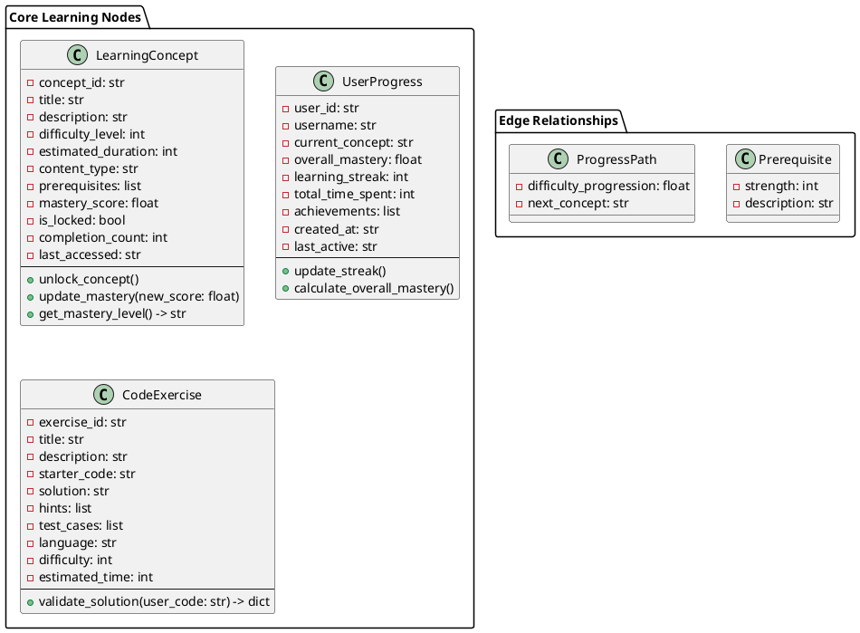
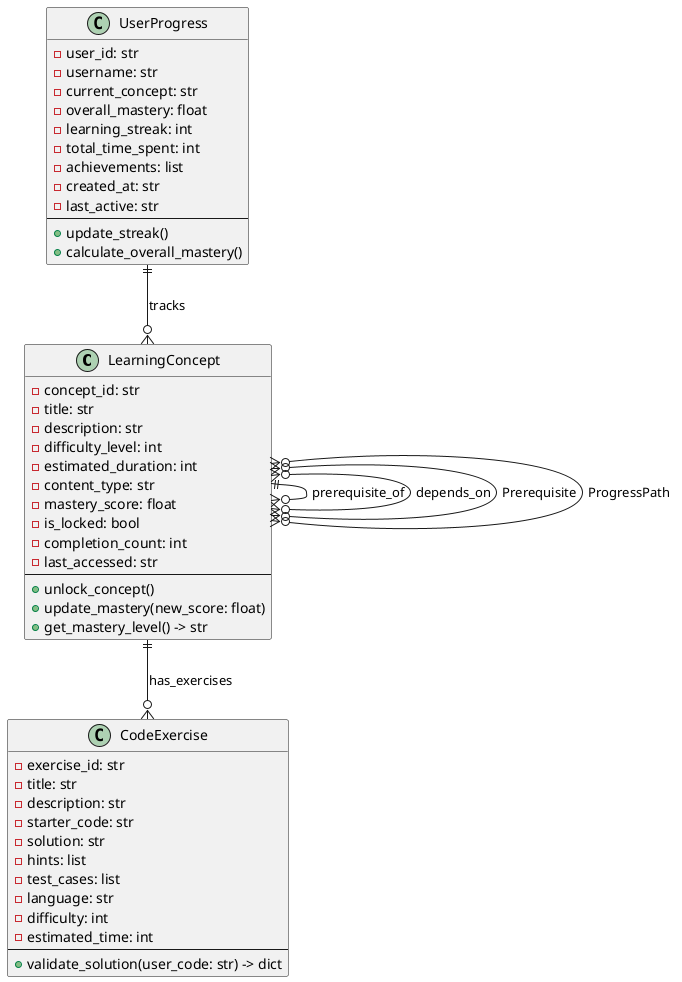
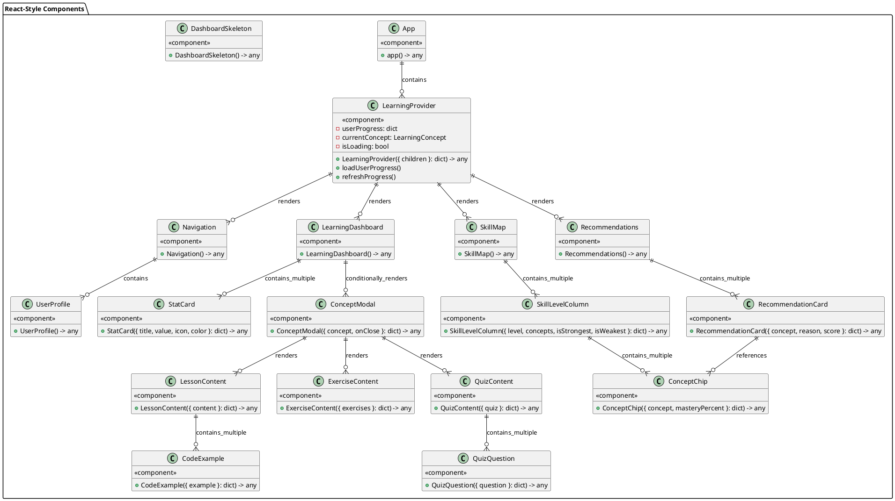
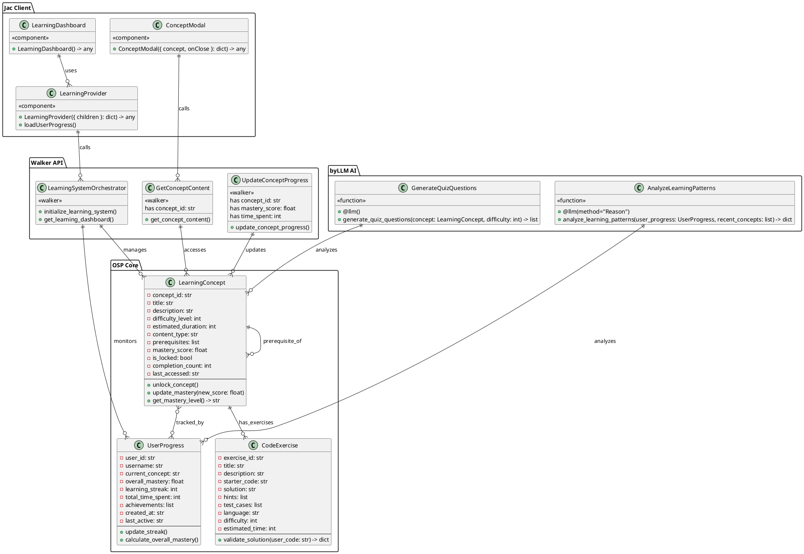

# Class Diagrams - Pure JAC Architecture

**Author:** Cavin Otieno  
**Date:** December 20, 2025  
**Architecture:** Pure JAC (Object-Spatial Programming)

## Overview

This document provides comprehensive class diagrams for the Jeseci Smart Learning Academy's pure-JAC architecture. The diagrams showcase the Object-Spatial Programming (OSP) models, their attributes, methods, and relationships using PlantUML syntax.

## Core Architecture Classes

## Object-Spatial Programming Relationships

## Walker API Integration

```plantuml
@startuml
' =============================================================================
' WALKER API INTEGRATION
' =============================================================================

package "Walker API Operations" {
  
  class LearningSystemOrchestrator {
    <<walker>>
    + initialize_learning_system()
    + seed_learning_concepts()
    + get_learning_dashboard()
    + generate_skill_map(concepts: list) -> dict
  }
  
  class GetOrCreateUser {
    <<walker>>
    has username: str
    + get_or_create_user()
  }
  
  class GetCurrentUserProgress {
    <<walker>>
    + get_current_user_progress()
  }
  
  class GetConceptContent {
    <<walker>>
    has concept_id: str
    + get_concept_content()
    + generate_concept_content(concept: LearningConcept) -> dict
    + get_concept_code_examples(concept: LearningConcept) -> list
    + get_interactive_elements(concept: LearningConcept) -> list
    + generate_concept_exercises(concept: LearningConcept) -> list
  }
  
  class UpdateConceptProgress {
    <<walker>>
    has concept_id: str
    has mastery_score: float
    has time_spent: int
    + update_concept_progress()
  }
  
  class GetPersonalizedRecommendations {
    <<walker>>
    + get_personalized_recommendations()
  }
  
  class GenerateQuizQuestions {
    <<walker>>
    has concept: LearningConcept
    has difficulty: int
    has num_questions: int
    + generate_quiz_questions()
  }
  
  class GetCodeExercise {
    <<walker>>
    has concept_id: str
    has exercise_id: str
    + get_code_exercise()
  }
}

' =============================================================================
' WALKER TO NODE RELATIONSHIPS
' =============================================================================

LearningSystemOrchestrator ||--o{ LearningConcept : manages
LearningSystemOrchestrator ||--o{ UserProgress : monitors

GetOrCreateUser ||--o{ UserProgress : creates/finds

GetCurrentUserProgress ||--o{ UserProgress : retrieves

GetConceptContent ||--o{ LearningConcept : accesses
GetConceptContent ||--o{ CodeExercise : generates

UpdateConceptProgress ||--o{ LearningConcept : updates
UpdateConceptProgress ||--o{ UserProgress : updates

GetPersonalizedRecommendations ||--o{ UserProgress : analyzes
GetPersonalizedRecommendations ||--o{ LearningConcept : recommends

GenerateQuizQuestions ||--o{ LearningConcept : generates_for

GetCodeExercise ||--o{ CodeExercise : retrieves

@enduml
```

## byLLM AI Integration Classes

```plantuml
@startuml
' =============================================================================
' BYLLM AI INTEGRATION
' =============================================================================

package "byLLM AI Decorators" {
  
  class AIModel {
    <<global>>
    - llm: Model
    + model_name: "gpt-4o-mini"
  }
  
  class GenerateQuizQuestions {
    <<function>>
    + @llm()
    + generate_quiz_questions(concept: LearningConcept, difficulty: int, num_questions: int = 5) -> list
  }
  
  class EvaluateFreeTextAnswer {
    <<function>>
    + @llm()
    + evaluate_free_text_answer(concept: LearningConcept, user_answer: str, correct_answer: str) -> dict
  }
  
  class GenerateLearningRecommendations {
    <<function>>
    + @llm()
    + generate_learning_recommendations(user_progress: UserProgress) -> list
  }
  
  class AnalyzeLearningPatterns {
    <<function>>
    + @llm(method="Reason")
    + analyze_learning_patterns(user_progress: UserProgress, recent_concepts: list) -> dict
  }
  
  class GenerateCodeHints {
    <<function>>
    + @llm()
    + generate_code_hints(exercise: CodeExercise, user_context: str) -> list
  }
  
  class CreateAdaptiveAssessment {
    <<function>>
    + @llm()
    + create_adaptive_assessment(concept: LearningConcept, user_history: dict) -> dict
  }
  
  class GenerateCodingExercise {
    <<function>>
    + @llm()
    + generate_coding_exercise(concept: LearningConcept, difficulty: int) -> CodeExercise
  }
}

' =============================================================================
' AI TO CORE CLASSES RELATIONSHIPS
' =============================================================================

AIModel ||--o{ GenerateQuizQuestions : powers
AIModel ||--o{ EvaluateFreeTextAnswer : powers
AIModel ||--o{ GenerateLearningRecommendations : powers
AIModel ||--o{ AnalyzeLearningPatterns : powers
AIModel ||--o{ GenerateCodeHints : powers
AIModel ||--o{ CreateAdaptiveAssessment : powers
AIModel ||--o{ GenerateCodingExercise : powers

GenerateQuizQuestions ||--o{ LearningConcept : analyzes
EvaluateFreeTextAnswer ||--o{ LearningConcept : evaluates
GenerateLearningRecommendations ||--o{ UserProgress : recommends_for
AnalyzeLearningPatterns ||--o{ UserProgress : analyzes
GenerateCodeHints ||--o{ CodeExercise : assists_with
CreateAdaptiveAssessment ||--o{ LearningConcept : creates_for
GenerateCodingExercise ||--o{ LearningConcept : generates_for
GenerateCodingExercise ||--o{ CodeExercise : creates

@enduml
```

## Jac Client Frontend Components

## Complete System Architecture

## Class Descriptions

### Core OSP Nodes

#### LearningConcept
**Purpose:** Represents individual learning topics and concepts in the curriculum.

**Key Attributes:**
- `concept_id`: Unique identifier for the concept
- `title`: Human-readable name of the concept
- `description`: Detailed explanation of what the concept covers
- `difficulty_level`: Scale from 1-5 indicating complexity
- `estimated_duration`: Expected time to complete in minutes
- `content_type`: Type of content (lesson, exercise, quiz, project)
- `prerequisites`: List of concept IDs required before this one
- `mastery_score`: User's proficiency level (0.0-1.0)
- `is_locked`: Whether the concept is accessible
- `completion_count`: Number of times the concept has been attempted
- `last_accessed`: Timestamp of most recent access

**Key Methods:**
- `unlock_concept()`: Makes the concept accessible when prerequisites are met
- `update_mastery(new_score)`: Updates mastery using exponential moving average
- `get_mastery_level()`: Returns human-readable mastery level (Novice to Expert)

**Role in System:** Central entity that drives the learning progression and content organization.

#### UserProgress
**Purpose:** Tracks individual user's learning journey and progress across all concepts.

**Key Attributes:**
- `user_id`: Unique identifier for the user
- `username`: User's display name
- `current_concept`: Currently active learning concept
- `overall_mastery`: Aggregate mastery across all concepts
- `learning_streak`: Consecutive days of activity
- `total_time_spent`: Cumulative learning time in minutes
- `achievements`: List of earned achievements and milestones
- `created_at`: User registration timestamp
- `last_active`: Date of most recent activity

**Key Methods:**
- `update_streak()`: Updates learning streak based on activity patterns
- `calculate_overall_mastery()`: Computes aggregate mastery score

**Role in System:** Provides personalized learning experience and progress tracking.

#### CodeExercise
**Purpose:** Interactive coding challenges that reinforce learning concepts.

**Key Attributes:**
- `exercise_id`: Unique identifier for the exercise
- `title`: Exercise name
- `description`: Exercise instructions and requirements
- `starter_code`: Initial code template for users
- `solution`: Correct implementation reference
- `hints`: Progressive hints to help users
- `test_cases`: Automated test scenarios
- `language`: Programming language (jac, python, etc.)
- `difficulty`: Exercise complexity (1-5 scale)
- `estimated_time`: Expected completion time in minutes

**Key Methods:**
- `validate_solution(user_code)`: AI-powered code evaluation and feedback

**Role in System:** Provides hands-on practice and skill assessment.

### Edge Relationships

#### Prerequisite
**Purpose:** Defines learning dependencies between concepts.

**Attributes:**
- `strength`: Importance level (1-5) of the prerequisite relationship
- `description`: Explanation of why this prerequisite is needed

#### ProgressPath
**Purpose:** Represents recommended learning progression routes.

**Attributes:**
- `difficulty_progression`: How much difficulty increases along this path
- `next_concept`: ID of the next recommended concept

### Walker API Classes

#### LearningSystemOrchestrator
**Purpose:** Main orchestrator that initializes and coordinates the learning system.

**Key Functions:**
- `initialize_learning_system()`: Sets up the learning environment
- `seed_learning_concepts()`: Populates initial learning content
- `get_learning_dashboard()`: Provides comprehensive progress overview
- `generate_skill_map()`: Creates visual skill progression mapping

#### GetConceptContent
**Purpose:** Retrieves and generates content for specific learning concepts.

**Key Functions:**
- `get_concept_content()`: Main content retrieval endpoint
- `generate_concept_content()`: AI-powered content creation
- `get_concept_code_examples()`: Provides relevant code examples
- `generate_concept_exercises()`: Creates interactive exercises

### byLLM AI Integration

#### AI Decorators
**Purpose:** Provides AI-powered learning assistance and personalization.

**Key Functions:**
- `generate_quiz_questions()`: Creates adaptive assessments
- `evaluate_free_text_answer()`: Analyzes open-ended responses
- `analyze_learning_patterns()`: Identifies learning optimization opportunities
- `generate_code_hints()`: Provides contextual coding assistance
- `create_adaptive_assessment()`: Generates personalized evaluations

### Jac Client Frontend Components

#### LearningProvider
**Purpose:** Context provider that manages global learning state.

**Key Functions:**
- `loadUserProgress()`: Fetches user progress from backend
- `refreshProgress()`: Updates local state with fresh data

#### LearningDashboard
**Purpose:** Main dashboard displaying user's learning overview.

**Key Features:**
- Progress statistics and metrics
- Current learning focus
- Achievement tracking
- Streak visualization

#### ConceptModal
**Purpose:** Modal component for detailed concept exploration.

**Key Features:**
- Tabbed content (lesson, exercises, quiz)
- Interactive code examples
- Progress tracking integration
- AI-powered content generation

## Architecture Benefits

1. **Native Persistence**: OSP provides built-in data persistence without external databases
2. **Graph-Based Learning**: Natural representation of learning dependencies and progression
3. **AI Integration**: Seamless byLLM integration for personalized learning experiences
4. **Full-Stack JAC**: Single language for backend, frontend, and AI components
5. **Scalable Design**: Modular architecture supports easy feature additions
6. **Interactive Learning**: Rich frontend with React-style components and real-time updates

## Next Steps

This class diagram foundation supports the complete learning portal architecture. Future enhancements may include:

- Additional learning assessment types
- Enhanced AI personalization algorithms
- Social learning features (peer collaboration)
- Advanced analytics and reporting
- Mobile-responsive design improvements

---

*This document is part of the Jeseci Smart Learning Academy architectural documentation suite.*