# 🏗️ Component Diagrams - Pure JAC Architecture

**Author:** Cavin Otieno  
**Date:** December 20, 2025  
**Version:** 2.0 (Pure JAC Architecture)  

## 🎯 Overview

This document provides comprehensive component diagrams for the Jeseci Smart Learning Academy's pure JAC architecture, showing how all components interact within the unified JAC ecosystem.

---

## 📊 System Component Diagram


---

## 🏗️ JAC Component Architecture

```mermaid
graph LR
    subgraph "Main Application"
        APP[app.jac Entry Point]
    end
    
    subgraph "Core JAC Components"
        OBJECTS[📦 JAC Objects]
        NODES[📋 OSP Nodes]
        EDGES[🔗 OSP Edges]
        WALKERS[🚶 JAC Walkers]
    end
    
    subgraph "Learning Components"
        USER[👤 User Node]
        CONCEPT[📚 Concept Node]
        LESSON[📖 Lesson Node]
        QUIZ[❓ Quiz Node]
    end
    
    subgraph "AI Components"
        CONTENT_GEN[📝 Content Generation]
        QUIZ_GEN[🎯 Quiz Generation]
        ASSESSMENT[✅ Assessment Engine]
        RECOMMENDATION[🎓 Learning Recommendations]
    end
    
    subgraph "API Endpoints (Auto-generated)"
        REGISTER[👥 Register User]
        GET_LESSON[📚 Get Lesson]
        GENERATE_QUIZ[🎯 Generate Quiz]
        SUBMIT_ANSWER[✅ Submit Answer]
        UPDATE_MASTERY[📈 Update Mastery]
    end
    
    %% Connections
    APP --> OBJECTS
    OBJECTS --> NODES
    OBJECTS --> EDGES
    OBJECTS --> WALKERS
    
    NODES --> USER
    NODES --> CONCEPT
    NODES --> LESSON
    NODES --> QUIZ
    
    WALKERS --> CONTENT_GEN
    WALKERS --> QUIZ_GEN
    WALKERS --> ASSESSMENT
    WALKERS --> RECOMMENDATION
    
    CONTENT_GEN --> REGISTER
    QUIZ_GEN --> GET_LESSON
    ASSESSMENT --> GENERATE_QUIZ
    RECOMMENDATION --> SUBMIT_ANSWER
    REGISTER --> UPDATE_MASTERY
    
    classDef objects fill:#e3f2fd
    classDef nodes fill:#e8f5e8
    classDef ai fill:#fff3e0
    classDef api fill:#fce4ec
    
    class OBJECTS objects
    class USER,CONCEPT,LESSON,QUIZ nodes
    class CONTENT_GEN,QUIZ_GEN,ASSESSMENT,RECOMMENDATION ai
    class REGISTER,GET_LESSON,GENERATE_QUIZ,SUBMIT_ANSWER,UPDATE_MASTERY api
```



---

## 🔄 Data Flow Component Diagram

```mermaid
sequenceDiagram
    participant U as 👤 User
    participant F as 🖥️ Frontend
    participant R as 🌐 jac serve
    participant W as 🚶 Walker
    participant G as 📊 JAC Graph
    participant A as 🤖 byLLM AI
    participant O as 📊 OpenAI API
    
    U->>F: Request Lesson
    F->>R: GET /functions/get_lesson
    R->>W: Call get_lesson walker
    W->>G: Check user mastery
    G-->>W: Return user data
    W->>A: Generate content request
    A->>O: Call OpenAI API
    O-->>A: Return generated content
    A-->>W: Return content
    W->>G: Update user progress
    G-->>W: Confirm update
    W-->>R: Return lesson data
    R-->>F: JSON response
    F-->>U: Display lesson
    
    Note over U,O: AI-Powered Learning Flow
```



---

## 🧠 OSP Data Model Components

```mermaid
graph TB
    subgraph "User Management"
        USER[👤 User Node]
        USER --> USER_PROFILE[📋 User Profile]
        USER --> USER_PREFERENCES[⚙️ Learning Preferences]
        USER --> USER_MASTERY[📈 Mastery Scores]
    end
    
    subgraph "Learning Content"
        CONCEPT[📚 Concept Node]
        CONCEPT --> CONCEPT_CONTENT[📝 Lesson Content]
        CONCEPT --> CONCEPT_PREREQUISITES[🔗 Prerequisites]
        CONCEPT --> CONCEPT_DIFFICULTY[🎯 Difficulty Level]
        
        LESSON[📖 Lesson Node]
        LESSON --> LESSON_CONTENT[📄 Lesson Material]
        LESSON --> LESSON_EXERCISES[💻 Interactive Exercises]
        LESSON --> LESSON_EXAMPLES[📋 Code Examples]
        
        QUIZ[❓ Quiz Node]
        QUIZ --> QUIZ_QUESTIONS[❓ Questions]
        QUIZ --> QUIZ_ANSWERS[✅ Answer Options]
        QUIZ --> QUIZ_FEEDBACK[💬 AI Feedback]
    end
    
    subgraph "Mastery Tracking"
        MASTERY_EDGE[📈 Mastery Edge]
        MASTERY_EDGE --> PROFICIENCY_SCORE[🎯 Proficiency Score]
        MASTERY_EDGE --> LAST_UPDATED[🕐 Last Updated]
        MASTERY_EDGE --> LEARNING_STREAK[🔥 Learning Streak]
    end
    
    subgraph "Graph Relationships"
        PREREQUISITE_EDGE[🔗 Prerequisite Edge]
        RELATED_EDGE[🔗 Related Concepts Edge]
        PROGRESSION_EDGE[📈 Learning Path Edge]
    end
    
    %% Relationships
    USER -.->|has mastery in| CONCEPT
    CONCEPT -.->|has lesson| LESSON
    CONCEPT -.->|has quiz| QUIZ
    USER -.->|mastery level| MASTERY_EDGE
    CONCEPT -.->|prerequisite| PREREQUISITE_EDGE
    
    classDef user fill:#e1f5fe
    classDef content fill:#e8f5e5
    classDef mastery fill:#fff3e0
    classDef relation fill:#f3e5f5
    
    class USER,USER_PROFILE,USER_PREFERENCES,USER_MASTERY user
    class CONCEPT,CONCEPT_CONTENT,CONCEPT_PREREQUISITES,CONCEPT_DIFFICULTY,LESSON,LESSON_CONTENT,LESSON_EXERCISES,LESSON_EXAMPLES,QUIZ,QUIZ_QUESTIONS,QUIZ_ANSWERS,QUIZ_FEEDBACK content
    class MASTERY_EDGE,PROFICIENCY_SCORE,LAST_UPDATED,LEARNING_STREAK mastery
    class PREREQUISITE_EDGE,RELATED_EDGE,PROGRESSION_EDGE relation
```



---

## 🤖 AI Integration Components

```mermaid
graph TB
    subgraph "AI Processing Layer"
        AI_ENGINE[🤖 AI Engine]
        CONTENT_GENERATOR[📝 Content Generator]
        QUIZ_GENERATOR[🎯 Quiz Generator]
        ASSESSMENT_ENGINE[✅ Assessment Engine]
        RECOMMENDATION_ENGINE[🎓 Recommendation Engine]
    end
    
    subgraph "byLLM Integration"
        BYLLM_DECORATOR[🎨 byLLM Decorator]
        PROMPT_MANAGER[📋 Prompt Manager]
        RESPONSE_PROCESSOR[⚙️ Response Processor]
    end
    
    subgraph "OpenAI Integration"
        OPENAI_CLIENT[🔌 OpenAI Client]
        API_MANAGER[🌐 API Manager]
        RATE_LIMITER[⏱️ Rate Limiter]
    end
    
    subgraph "AI Use Cases"
        CONTENT_GEN_USE[📝 Content Generation]
        QUIZ_GEN_USE[🎯 Quiz Generation]
        ANSWER_EVAL_USE[✅ Answer Evaluation]
        PATH_OPT_USE[🎓 Learning Path Optimization]
        FEEDBACK_GEN_USE[💬 Feedback Generation]
    end
    
    %% AI Processing connections
    AI_ENGINE --> CONTENT_GENERATOR
    AI_ENGINE --> QUIZ_GENERATOR
    AI_ENGINE --> ASSESSMENT_ENGINE
    AI_ENGINE --> RECOMMENDATION_ENGINE
    
    %% byLLM connections
    CONTENT_GENERATOR --> BYLLM_DECORATOR
    QUIZ_GENERATOR --> BYLLM_DECORATOR
    ASSESSMENT_ENGINE --> BYLLM_DECORATOR
    RECOMMENDATION_ENGINE --> BYLLM_DECORATOR
    
    BYLLM_DECORATOR --> PROMPT_MANAGER
    PROMPT_MANAGER --> RESPONSE_PROCESSOR
    
    %% OpenAI connections
    RESPONSE_PROCESSOR --> OPENAI_CLIENT
    OPENAI_CLIENT --> API_MANAGER
    API_MANAGER --> RATE_LIMITER
    
    %% Use case connections
    CONTENT_GEN_USE --> CONTENT_GENERATOR
    QUIZ_GEN_USE --> QUIZ_GENERATOR
    ANSWER_EVAL_USE --> ASSESSMENT_ENGINE
    PATH_OPT_USE --> RECOMMENDATION_ENGINE
    FEEDBACK_GEN_USE --> ASSESSMENT_ENGINE
    
    classDef ai fill:#e8f5e8
    classDef byllm fill:#fff3e0
    classDef openai fill:#e1f5fe
    classDef use_cases fill:#fce4ec
    
    class AI_ENGINE,CONTENT_GENERATOR,QUIZ_GENERATOR,ASSESSMENT_ENGINE,RECOMMENDATION_ENGINE ai
    class BYLLM_DECORATOR,PROMPT_MANAGER,RESPONSE_PROCESSOR byllm
    class OPENAI_CLIENT,API_MANAGER,RATE_LIMITER openai
    class CONTENT_GEN_USE,QUIZ_GEN_USE,ANSWER_EVAL_USE,PATH_OPT_USE,FEEDBACK_GEN_USE use_cases
```



---

## 🌐 API Component Architecture

```mermaid
graph TB
    subgraph "HTTP Layer"
        HTTP_SERVER[🌐 HTTP Server]
        REQUEST_ROUTER[🔀 Request Router]
        MIDDLEWARE_STACK[🔧 Middleware Stack]
    end
    
    subgraph "JAC Walker Layer"
        USER_WALKERS[👥 User Management Walkers]
        CONTENT_WALKERS[📚 Content Walkers]
        ASSESSMENT_WALKERS[✅ Assessment Walkers]
        ANALYTICS_WALKERS[📊 Analytics Walkers]
    end
    
    subgraph "Walker Implementations"
        REGISTER_WALKER[👤 register_user Walker]
        GET_LESSON_WALKER[📚 get_lesson Walker]
        GENERATE_QUIZ_WALKER[🎯 generate_quiz Walker]
        SUBMIT_ANSWER_WALKER[✅ submit_answer Walker]
        UPDATE_MASTERY_WALKER[📈 update_mastery Walker]
        GET_ANALYTICS_WALKER[📊 get_analytics Walker]
    end
    
    subgraph "Response Handlers"
        JSON_SERIALIZER[📄 JSON Serializer]
        ERROR_HANDLER[⚠️ Error Handler]
        VALIDATOR[✅ Request Validator]
    end
    
    subgraph "Auto-generated Endpoints"
        REGISTER_ENDPOINT[👥 /functions/register_user]
        GET_LESSON_ENDPOINT[📚 /functions/get_lesson]
        GENERATE_QUIZ_ENDPOINT[🎯 /functions/generate_quiz]
        SUBMIT_ANSWER_ENDPOINT[✅ /functions/submit_answer]
        UPDATE_MASTERY_ENDPOINT[📈 /functions/update_mastery]
        GET_ANALYTICS_ENDPOINT[📊 /functions/get_analytics]
    end
    
    %% HTTP Layer connections
    HTTP_SERVER --> REQUEST_ROUTER
    REQUEST_ROUTER --> MIDDLEWARE_STACK
    MIDDLEWARE_STACK --> USER_WALKERS
    MIDDLEWARE_STACK --> CONTENT_WALKERS
    MIDDLEWARE_STACK --> ASSESSMENT_WALKERS
    MIDDLEWARE_STACK --> ANALYTICS_WALKERS
    
    %% Walker connections
    USER_WALKERS --> REGISTER_WALKER
    CONTENT_WALKERS --> GET_LESSON_WALKER
    CONTENT_WALKERS --> GENERATE_QUIZ_WALKER
    ASSESSMENT_WALKERS --> SUBMIT_ANSWER_WALKER
    ANALYTICS_WALKERS --> UPDATE_MASTERY_WALKER
    ANALYTICS_WALKERS --> GET_ANALYTICS_WALKER
    
    %% Handler connections
    REGISTER_WALKER --> JSON_SERIALIZER
    GET_LESSON_WALKER --> JSON_SERIALIZER
    GENERATE_QUIZ_WALKER --> JSON_SERIALIZER
    SUBMIT_ANSWER_WALKER --> JSON_SERIALIZER
    UPDATE_MASTERY_WALKER --> JSON_SERIALIZER
    GET_ANALYTICS_WALKER --> JSON_SERIALIZER
    
    JSON_SERIALIZER --> ERROR_HANDLER
    ERROR_HANDLER --> VALIDATOR
    
    %% Endpoint connections
    REGISTER_ENDPOINT -.-> REGISTER_WALKER
    GET_LESSON_ENDPOINT -.-> GET_LESSON_WALKER
    GENERATE_QUIZ_ENDPOINT -.-> GENERATE_QUIZ_WALKER
    SUBMIT_ANSWER_ENDPOINT -.-> SUBMIT_ANSWER_WALKER
    UPDATE_MASTERY_ENDPOINT -.-> UPDATE_MASTERY_WALKER
    GET_ANALYTICS_ENDPOINT -.-> GET_ANALYTICS_WALKER
    
    classDef http fill:#e3f2fd
    classDef walkers fill:#e8f5e8
    classDef handlers fill:#fff3e0
    classDef endpoints fill:#fce4ec
    
    class HTTP_SERVER,REQUEST_ROUTER,MIDDLEWARE_STACK http
    class USER_WALKERS,CONTENT_WALKERS,ASSESSMENT_WALKERS,ANALYTICS_WALKERS,REGISTER_WALKER,GET_LESSON_WALKER,GENERATE_QUIZ_WALKER,SUBMIT_ANSWER_WALKER,UPDATE_MASTERY_WALKER,GET_ANALYTICS_WALKER walkers
    class JSON_SERIALIZER,ERROR_HANDLER,VALIDATOR handlers
    class REGISTER_ENDPOINT,GET_LESSON_ENDPOINT,GENERATE_QUIZ_ENDPOINT,SUBMIT_ANSWER_ENDPOINT,UPDATE_MASTERY_ENDPOINT,GET_ANALYTICS_ENDPOINT endpoints
```



---

## 🚀 Deployment Component Diagram

```mermaid
graph TB
    subgraph "Development Environment"
        LOCAL_SETUP[💻 Local Setup]
        DEV_SERVER[🔧 Development Server]
        DEBUG_MODE[🐛 Debug Mode]
    end
    
    subgraph "Production Environment"
        JAC_CLOUD[☁️ JAC Cloud Platform]
        AUTO_SCALING[📈 Auto Scaling]
        LOAD_BALANCER[⚖️ Load Balancer]
        MONITORING[📊 Monitoring]
    end
    
    subgraph "Deployment Process"
        BUILD[🔨 Build Process]
        DEPLOY[🚀 Deploy Command]
        VERIFY[✅ Verification]
    end
    
    subgraph "Setup Components"
        SETUP_SCRIPT[📜 setup_pure_jac.sh]
        VENV[🐍 Virtual Environment]
        DEPENDENCIES[📦 Dependencies]
    end
    
    subgraph "Infrastructure"
        DOCKER[🐳 Docker Container]
        KUBERNETES[☸️ Kubernetes (Optional)]
        CI_CD[🔄 CI/CD Pipeline]
    end
    
    %% Setup connections
    SETUP_SCRIPT --> VENV
    VENV --> DEPENDENCIES
    DEPENDENCIES --> LOCAL_SETUP
    LOCAL_SETUP --> DEV_SERVER
    
    %% Deployment connections
    BUILD --> DEPLOY
    DEPLOY --> JAC_CLOUD
    DEPLOY --> DOCKER
    DOCKER --> KUBERNETES
    DEPLOY --> CI_CD
    
    %% Production connections
    JAC_CLOUD --> AUTO_SCALING
    AUTO_SCALING --> LOAD_BALANCER
    LOAD_BALANCER --> MONITORING
    
    %% Verification
    DEPLOY --> VERIFY
    
    classDef setup fill:#e8f5e8
    classDef dev fill:#e1f5fe
    classDef prod fill:#fff3e0
    classDef deploy fill:#fce4ec
    
    class SETUP_SCRIPT,VENV,DEPENDENCIES setup
    class LOCAL_SETUP,DEV_SERVER,DEBUG_MODE dev
    class JAC_CLOUD,AUTO_SCALING,LOAD_BALANCER,MONITORING prod
    class BUILD,DEPLOY,VERIFY,DOCKER,KUBERNETES,CI_CD deploy
```

---

## 📱 Frontend Component Architecture


---

## 📋 Component Summary

### Frontend Components
- **Jac Client UI**: React-style components in JAC
- **Dashboard**: Real-time progress visualization
- **Code Editor**: Interactive Monaco/CodeMirror integration
- **Progress Charts**: Learning analytics visualization

### Backend Components (JAC)
- **Walkers**: API endpoints and business logic
- **Nodes**: User, Concept, Lesson, Quiz data models
- **Edges**: Mastery and relationship tracking
- **byLLM**: AI content generation and assessment

### Data Layer Components
- **JAC Graph**: Native graph database
- **OSP Models**: Object-Spatial Programming data structures
- **Persistence**: Automatic data storage and retrieval
- **Caching**: In-memory performance optimization

### AI Integration Components
- **byLLM Decorators**: AI-powered function calls
- **OpenAI Client**: External AI service integration
- **Content Generation**: Automated lesson creation
- **Assessment Engine**: Intelligent answer evaluation

### Deployment Components
- **JAC Cloud**: Managed hosting platform
- **Auto Scaling**: Automatic resource allocation
- **Load Balancing**: Traffic distribution
- **Monitoring**: Performance and health tracking

---

## 📚 Related Documentation

- **Architecture Overview**: `docs/architecture/architecture_overview.md`
- **API Reference**: `docs/architecture/api_reference.md`
- **Deployment Guide**: `docs/architecture/deployment_architecture.md`
- **Developer Guide**: `docs/architecture/developer_guide.md`